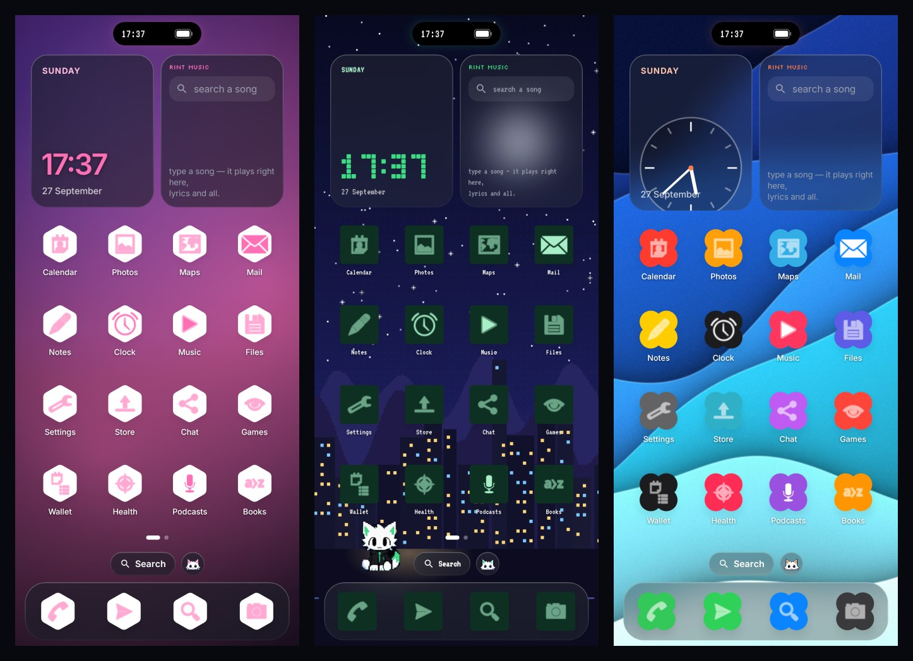

# RintOS 1.4

A deeply customizable Android launcher, with a white fox-cat roommate named **Rin**.

Made by Carrot.


## What's inside

- **English or Português (Brasil)**: picked on first launch (a blank screen, two buttons, then the intro). Everything switches, including the intro, settings, widgets, Rin's popups, and the assistant, which replies in Portuguese, listens in pt-BR and speaks with a Brazilian voice. Change it any time in Settings → Look & feel → Language.
- **Home screen**: grid (3–7 columns, 4–9 rows), 8 page transitions, drag and drop between pages and the dock, rename/hide apps, icon packs, 10 icon shapes, 5 icon styles, frosted glass, a magnifying dock.
- **Wallpapers**: your own photo, any live wallpaper, six built-in artworks (incl. sunset, synthwave, snowy peaks), solid, gradient, an animated aurora, and three built-in live wallpapers in your accent color (starfield, rain on glass, waves). Optional film grain and dimming.
- **Your colors**: accent color used everywhere, plus custom background, panel and text colors.
- **Widgets**: clock (7 faces incl. tty blocks), Rint Music, Photos slideshow, Rin the pet, Ask Rin, sticky note, checklist, focus timer, calculator, tally, dice, flashlight, battery, month calendar, weather, countdown, world clock, Rin's daily thought, device stats, stopwatch. Other apps' Android widgets work too.
- **Rint Music**: search right inside the widget and the song plays there, with live synced lyrics on the widget. Tap it while playing for quick actions: fullscreen, pause, open in your music app, and **Stop music**. Songs stream in full from Audius (free, no key); full-song results are listed first and marked **FULL**. No previews. If a song has no free full version, one tap opens it in your music app. Files on your phone and your own music app work too. No YouTube.
- **Rin assistant**: hold the home button anywhere and Rin slides up like Siri: talk or type, and your words appear live. Powered by **Gemini, Groq, Claude or OpenRouter** (you pick the model). Rin can see the screen, tap, type, scroll, open apps and play music, in a floating panel you can collapse or close. He asks before anything irreversible.
  - Gemini keys from AI Studio (including the new `AQ.` keys) work, and also unlock Rin's voice.
  - **Rin remembers you**: tell him things ("remember my exam is on Friday") and he keeps them, plus which apps you open at which hours. Everything stays on the phone; see or delete it in Settings.
- **Serious alerts only**: Rin pops up for very low battery (5% and 1%) and emergency broadcasts (tornado, amber alerts). Nothing else.
- **Battery saver**: when battery runs low, the home screen folds into a single breathing dot with a battery ring. Tap it for a plain app list with Rin; settings are one tap away. Plug in and it unfolds again.
- **Saver Home**: a lighter home for weak phones: widgets float away, leaving wallpaper, apps, pages, search, the Rin button and the dock.
- **Lock screen**: 11 styles (new: Neon), clock font, size and position, blurred/black/glow backgrounds, a greeting, up to 10 shortcuts, 5 unlock effects. It sits on top of the system lock screen, so your PIN/fingerprint still protects the phone.
- **Notch**: your own dynamic island with live music activity, now floating over every app, with open/close sounds (quiet during music and on silent). Only real music counts: your chosen music app, and YouTube only when it's actually a song.
- **Startup screen**: four designs (the default a detailed RintOS one) that play once after every restart, in your accent color. It never touches the system boot animation, so it can't break anything.
- **Settings**: 220+ options in grouped lists, a live preview, presets, search, export/import.
- **Rin himself**: drawn entirely in code, pixel art by default (or smooth 2D with a 2.5D head), in your accent color, with 40+ animations (waving, dancing, playing guitar, singing, eating, purring, crying, getting angry, winking, spinning, celebrating…).
- **The 1.4 intro**: 60 seconds, set to "Upgrade", a new 120 BPM track synthesized live (no audio files). It starts as an 8-bit chiptune, gets bit-crushed while an "UPGRADING" bar fills, then drops into full sound (funk bass, electric piano, marimba, strings). The film shows what you already love in 8-bit, then eight new features one per bar, a 3D voxel "1.4", a warp tunnel with Rin's new moves, credits, then the START button.
- **Settings → Dangerous**: nine buttons you should not press. Guitar solo, deleting System32, downloading more RAM, summoning 100 Rins, self destruct, and more. All jokes; none of them do anything bad.

## More looks

Same launcher, three setups: pink hexagons with a mesh gradient, green terminal on Pixel Night, and clover icons on Tide. Rin (and the Rin in the Pixel Night wallpaper) follows your accent color.



## Install

Grab `RintOS-1.4.apk` from the [Releases](../../releases) page, install it, open it and pick RintOS as your home app.

## Build

Requirements: JDK 17+ and the Android SDK (platform 35).

```bash
./gradlew :app:assembleRelease        # app/build/outputs/apk/release/
./gradlew :app:testDebugUnitTest      # logic tests + screenshot checks
./gradlew :app:recordPaparazziDebug   # re-render the screenshots in app/src/test/snapshots
```

## Permissions

| Permission | What it unlocks |
|---|---|
| Default home app | RintOS appears when you press home |
| Default assistant | Hold home to talk to Rin |
| Notification access | Notification dots, live lyrics for other music apps, emergency alerts |
| Display over other apps | Rin's popups and floating panel over other apps |
| Music & audio | Playing your own song files |
| Microphone | Talking to Rin |
| Accessibility ("RintOS gestures") | Double-tap to lock, recents, auto lock screen, and Rin operating the phone (only while you've asked him to) |

## Notes

- Free, legal full-length streaming covers Audius's catalog; for other songs RintOS hands off to your music app instead of playing a preview.
- The intro's 3D is rendered natively (perspective camera, shaded cubes, depth sorting), so it works on every phone with no WebView or WebGL.
- API keys stay on the phone, are never exported, and the app opts out of cloud backup.
