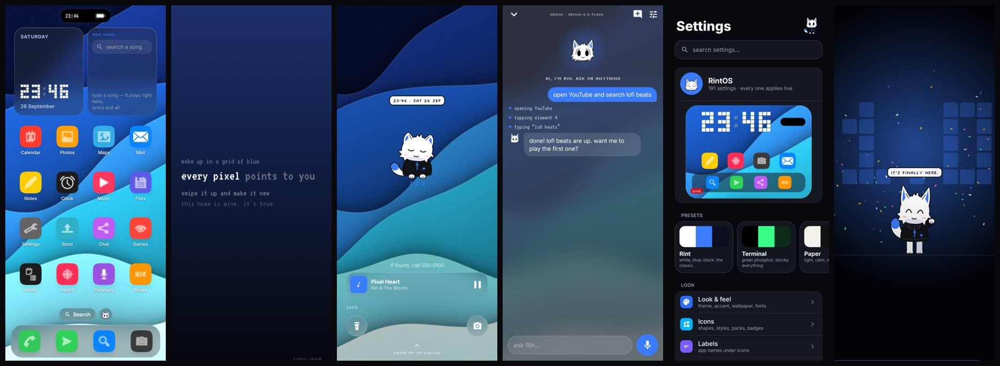

# RintOS 1.3

A deeply customizable Android launcher, with a white fox-cat roommate named **Rin**.

Made by Carrot.



## What's inside

- **Home screen**: grid (3–7 columns, 4–9 rows), 8 page transitions, drag and drop between pages and the dock, rename/hide apps, icon packs, 10 icon shapes, 5 icon styles, frosted glass, a magnifying dock.
- **Wallpapers**: your own photo, any live wallpaper, three built-in artworks, solid, gradient, or an animated aurora. Optional film grain and dimming.
- **Your colors**: accent color used everywhere, plus custom background, panel and text colors.
- **Widgets**: clock (7 faces incl. tty blocks), Rint Music, Photos slideshow, Rin the pet, Ask Rin, sticky note, checklist, focus timer, calculator, tally, dice, flashlight, battery, month calendar, weather. Other apps' Android widgets work too.
- **Rint Music**: search right inside the widget and the song plays there, with live synced lyrics on the widget. Tap it while playing for quick actions: fullscreen, pause, open in your music app, and **Stop music**. Songs stream from free music APIs with automatic fallbacks: full songs from Audius when it has the exact track, otherwise official 30-second previews from Deezer or Apple. Search results marked **FULL** are complete songs from Audius and play instantly. Files on your phone and your own music app work too. No YouTube.
- **Rin assistant**: hold the home button anywhere and Rin slides up like Siri: talk or type, and your words appear live. Powered by **Gemini, Groq, Claude or OpenRouter** (you pick the model). Rin can see the screen, tap, type, scroll, open apps and play music, in a floating panel you can collapse or close. He asks before anything irreversible.
  - Gemini keys from AI Studio (including the new `AQ.` keys) work, and also unlock Rin's voice.
- **Serious alerts only**: Rin pops up for very low battery (5% and 1%) and emergency broadcasts (tornado, amber alerts). Nothing else.
- **Battery saver**: when battery runs low, the home screen folds into a single dot. Tap it for a plain app list with Rin in the middle. Plug in and it unfolds again.
- **Lock screen**: 10 styles, up to 10 shortcuts, 5 unlock effects. It sits on top of the system lock screen, so your PIN/fingerprint still protects the phone.
- **Notch**: your own dynamic island with live music activity.
- **Settings**: 190+ options in grouped lists, a live preview, presets, search, export/import.
- **Rin himself**: drawn entirely in code, flat 2D with a 2.5D head, and a lot of animations (waving, cheering, dancing, yawning, stretching, laughing, being confused, playing guitar…).
- **The 1.3 intro**: 84 seconds, set to "Rin's Anthem", an original 128 BPM track synthesized live (no audio files): a music-box opening, trap-hat build-ups, two drops (the second one future-bass), vocal chops, a piano breakdown, a moment of silence and a key change; real-time 3D scenes drawn by a small built-in 3D renderer (a voxel wordmark, a warp tunnel, a giant 3D "1.3"); the whole story of how RintOS got here; credits; then the START button.
- **Settings → Dangerous**: nine buttons you should not press. Guitar solo, deleting System32, downloading more RAM, summoning 100 Rins, self destruct, and more. All jokes; none of them do anything bad.

## Install

Grab `RintOS-1.3.apk` from the [Releases](../../releases) page, install it, open it and pick RintOS as your home app.

## Build

Requirements: JDK 17+ and the Android SDK (platform 35).

```bash
./gradlew :app:assembleRelease        # app/build/outputs/apk/release/
./gradlew :app:testDebugUnitTest      # logic tests + screenshot checks
./gradlew :app:recordPaparazziDebug   # re-render the screenshots in app/src/test/snapshots
```

## Permissions

| Permission | What it unlocks |
|---|---|
| Default home app | RintOS appears when you press home |
| Default assistant | Hold home to talk to Rin |
| Notification access | Notification dots, live lyrics for other music apps, emergency alerts |
| Display over other apps | Rin's popups and floating panel over other apps |
| Music & audio | Playing your own song files |
| Microphone | Talking to Rin |
| Accessibility ("RintOS gestures") | Double-tap to lock, recents, auto lock screen, and Rin operating the phone (only while you've asked him to) |

## Notes

- Free, legal music APIs only have full-length streams for part of the catalog (Audius); for everything else you get the official 30-second preview plus a one-tap "open in my music app".
- The intro's 3D is rendered natively (perspective camera, shaded cubes, depth sorting), so it works on every phone with no WebView or WebGL.
- API keys stay on the phone, are never exported, and the app opts out of cloud backup.
